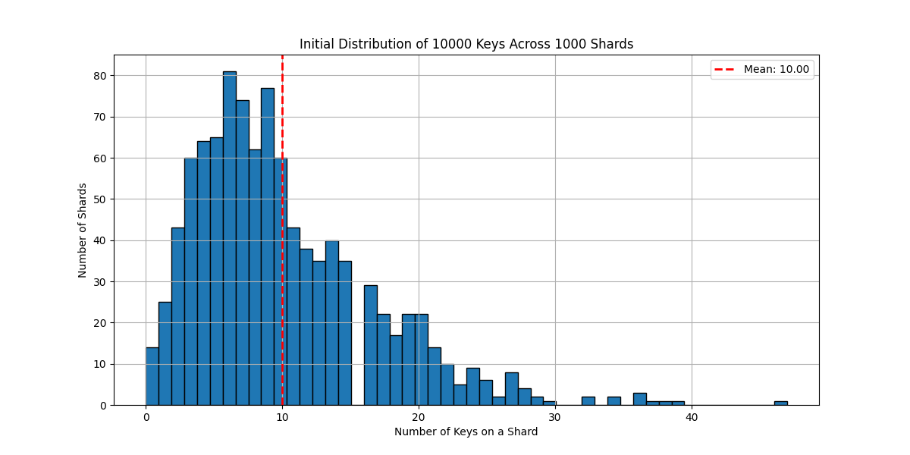

# System Design Prototypes

A collection of fun, hands-on prototypes to learn and remember key system design concepts. Each section explains the concept in simple, first-principles language, with diagrams and code to help you visualize and build intuition.

---

## Table of Contents
- [Multi Threading](#multi-threading)
- [Blocking Queues](#blocking-queues)
- [WebSockets](#websockets)
- [Real-Time Chats](#real-time-chats)
- [Two-Phase Commit (Distributed Transactions)](#two-phase-commit-distributed-transactions)
- [Unique ID Generation in Distributed Systems](#unique-id-generation-in-distributed-systems)
- [Simple CDN (Content Delivery Network)](#simple-cdn-content-delivery-network)
- [Consistent Hashing for Sharding](#consistent-hashing-for-sharding)

---

## Multi Threading
**Concept:**
Multi-threading allows a program to do multiple things at the same time. Imagine a chef cooking several dishes at once, instead of waiting for one to finish before starting the next. This is useful for speeding up programs, especially when tasks can run independently.

---

## Blocking Queues
**Concept:**
A blocking queue is like a waiting line at a store. If the line is full, new people (tasks) have to wait before joining. If the line is empty, the cashier (worker) waits for someone to arrive. This helps coordinate work between producers (who add tasks) and consumers (who process them).

---

## WebSockets
**Concept:**
WebSockets let your browser and a server talk to each other instantly, like a phone call instead of sending letters. This is great for chat apps, games, or anything that needs real-time updates.

**Example:**
- Connect to a WebSocket server from PowerShell:

```
$tcpClient = New-Object System.Net.Sockets.TcpClient("localhost", 3000)
$networkStream = $tcpClient.GetStream()
```

---

## Real-Time Chats
**Concept:**
A real-time chat app lets users send and receive messages instantly, just like texting. Under the hood, it often uses WebSockets to keep everyone in sync.

---

## Two-Phase Commit (Distributed Transactions)
**Concept:**
Imagine you and a friend want to buy a pizza together, but only if both of you have enough money. You both check your wallets (prepare phase). If you both have enough, you pay (commit). If either of you doesn't, you both walk away (abort). This is how distributed transactions work: all parts must agree to proceed, or nothing happens.

**Why is it needed?**
In a system with many services (like inventory and delivery), you want to make sure either all changes happen, or none do. This keeps your data consistent.

**How it works (with diagram):**

```
+-----------+        +-------------------+        +-------------------+
|  Client   |<-----> |   Coordinator     |<-----> |  Participants     |
+-----------+        +-------------------+        +-------------------+
     |                      |                           |
     | 1. Start Txn         |                           |
     |--------------------->|                           |
     |                      | 2. Prepare?               |
     |                      |-------------------------->|
     |                      |<--------------------------|
     |                      | 3. All Ready?             |
     |                      | 4. Commit/Abort           |
     |                      |-------------------------->|
     |                      |<--------------------------|
     | 5. Result            |                           |
     |<---------------------|                           |
```

- **Prepare:** All participants check if they can do the work.
- **Commit/Abort:** If all are ready, commit. If any fail, abort.

---

## Unique ID Generation in Distributed Systems
**Concept:**
When you split your data across many databases (shards), you can't just use auto-incrementing IDs (like 1, 2, 3...) because different shards might create the same ID. You need a way to make sure every ID is unique, everywhere.

**Why not just use UUIDs?**
- UUIDs are unique, but they're big and random. This makes databases slow because new data gets scattered everywhere (imagine putting new books in random spots on a shelf).
- Sequential, time-sortable IDs (like Snowflake IDs) keep things fast and organized.

**How does a Snowflake ID work?**
It combines:
- The current time (so IDs are ordered)
- A worker number (so many servers can make IDs at once)
- A sequence number (so you can make lots of IDs in the same millisecond)

**Bitwise Diagram:**
```
[63, ..., 58] [57, ..., 17]   [16, ..., 12]    [11, ..., 0]
+-------------+-----------------+------------------+-----------------+
| Unused (6)  |  Timestamp (41) |  Worker ID (5)   |  Sequence (12)  |
+-------------+-----------------+------------------+-----------------+
```

- **Sequence (Bits 0-11):** Counts up for each ID in the same millisecond.
- **Worker ID (Bits 12-16):** Which server made the ID.
- **Timestamp (Bits 17-57):** When the ID was made.

**Why is this better?**
- IDs are unique, ordered, and fast for databases to handle.

---

## Simple CDN (Content Delivery Network)
**Concept:**
A CDN is like a network of mini-libraries spread around the world. When you want a book (web content), you go to the nearest library (CDN server) instead of the main one (origin server). This makes things much faster!

**What are we building?**
- Our CDN server runs on `localhost` and acts as a cache.
- The origin server is set to a real website (e.g., `arpitbhayani.me`).
- When you request a page from the CDN:
    - If the CDN has the content cached, it serves it instantly (cache hit).
    - If not, it fetches the content from the origin server, caches it, and then serves it (cache miss).

**How does a request flow in our CDN?**
```
+--------+        +---------+        +---------------+
|  User  | <----> |  CDN    | <----> | Origin Server |
+--------+        +---------+        +---------------+
     |                |                    |
     | 1. Request     |                    |
     |--------------->|                    |
     |                | 2. Cache Miss?     |
     |                |------------------->|
     |                | 3. Fetch Content   |
     |                |<-------------------|
     | 4. Serve &     |                    |
     |    Cache       |                    |
     |<---------------|                    |
```

- **Step 1:** User requests a resource from the CDN (localhost).
- **Step 2:** CDN checks its cache. If not found, it forwards the request to the origin server.
- **Step 3:** CDN receives the content from the origin server and stores it in its cache.
- **Step 4:** CDN serves the content to the user. Next time, the same request will be served directly from the cache.

This simple prototype demonstrates the core idea behind real-world CDNs like Cloudflare, Akamai, or AWS CloudFront.

---

## Consistent Hashing for Sharding
Consistent hashing is a technique used by many distributed databases (like MongoDB, DynamoDB, Cassandra) and caches to efficiently distribute data across multiple nodes (shards) and minimize data movement when nodes are added or removed.

**Motivation:**
- In traditional sharding (e.g., `hash(key) % num_shards`), adding or removing a shard changes the mapping for almost every key, causing massive data reshuffling, downtime, and slow response times.
- Consistent hashing solves this by mapping both data and shards onto a hash ring. Each data item is assigned to the next shard clockwise on the ring.
- When a shard is added or removed, only a small subset of data (the data between the new/removed shard and its predecessor) needs to be moved, greatly reducing disruption.

**Traditional Sharding Example (Modulo Hash):**
Suppose you have 4 shards and use `hash(key) % 4` to assign data:
- Keys 1, 5, 9, ... go to Shard 1
- Keys 2, 6, 10, ... go to Shard 2
- Keys 3, 7, 11, ... go to Shard 3
- Keys 0, 4, 8, ... go to Shard 0

If you add a 5th shard, the mapping changes to `hash(key) % 5`, and almost every key will be reassigned to a new shard. This causes massive data movement and can lead to downtime and slow response as data is shuffled.

**Consistent Hashing Diagram:**
```
          +-------------------+
         /         |           \
   (S1) o          |           o (S2)
        |          |          /
        |         o|         /
        |        / |        /
        |       /  |       /
        |      /   |      /
        |     /    |     /
        |    /     |    /
        |   /      |   /
        |  /       |  /
        | /        | /
   (S4) o----------o (S3)
```
- S1, S2, S3, S4 = Shards/Servers (placed on the ring by their hash)
- o = Data keys, each mapped to the next server clockwise

If you add or remove a shard, only the keys between the new/removed shard and its predecessor move, minimizing disruption.

**Benefits:**
- Minimal data movement on scaling events
- Even data distribution (with virtual nodes)
- High availability and scalability for distributed systems

**Visualizing the Distribution**
To see this in action, I ran a simulation with 1,000 shards and 10,000 keys. The script `test_consistent_hashing.py` simulates adding and removing shards to measure the impact on key distribution.

1.  **Initial Distribution**: With 1,000 shards, the keys are spread out fairly evenly. The average number of keys per shard is 10, but as the histogram shows, some shards get more and some get less. This is natural variance.

    

2.  **Removing 50 Shards**: When 50 shards are removed, only **4.95%** of the keys need to be moved to new shards. A traditional hash would have required remapping almost all keys.

    

3.  **Adding 50 New Shards**: Similarly, when 50 new shards are added, only **4.55%** of the keys are moved to the new shards.

    

These results clearly show why consistent hashing is so powerful for building scalable, resilient systems. It handles changes to the number of servers gracefully, without causing a massive data reshuffle.

---

